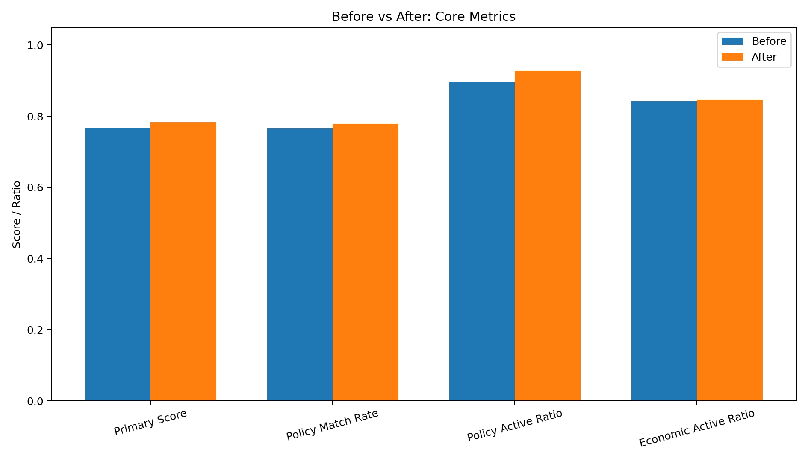
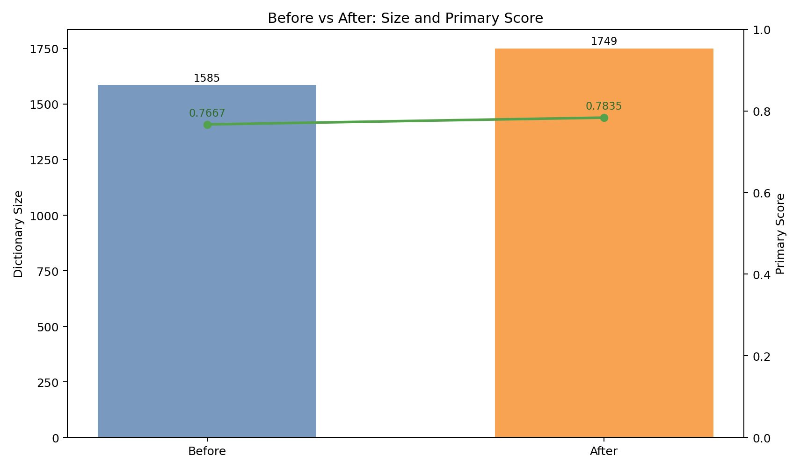
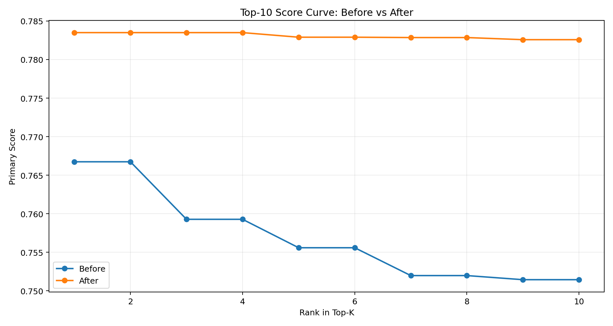
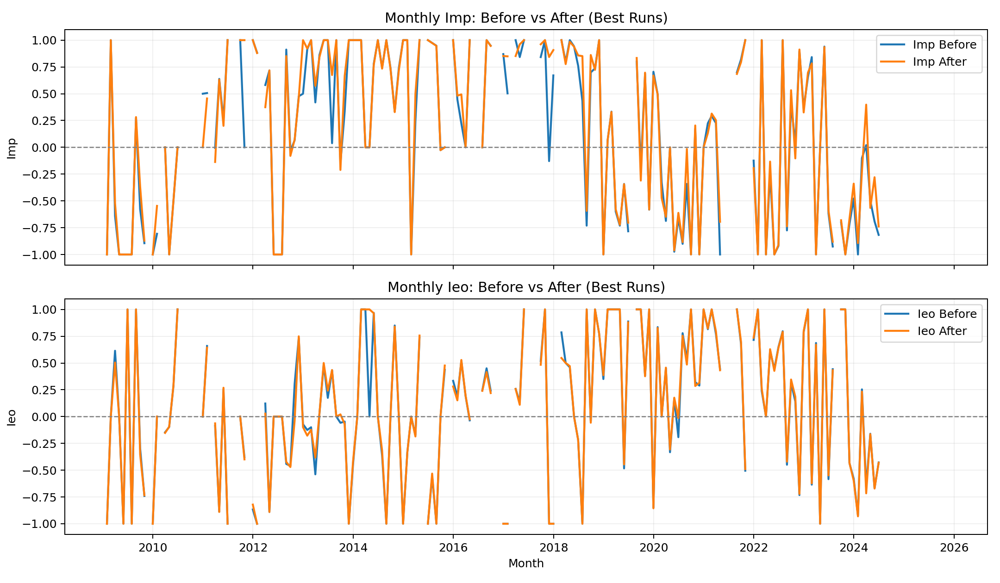

# MonetaryEconomic

## 实验背景
央行沟通文本（新闻稿、采访、发布会等）包含大量政策倾向与经济判断信息，但原始文本难以直接用于量化分析。  
本项目面向该问题，构建了一个可复现的文本量化流程：从事件文本中抽取短语、构建实时词典、计算事件级指数，并通过参数实验评估方法稳定性与效果。

## 实验目的
1. 为每条沟通事件生成两个可比较的量化指标：`Imp`（货币政策）与 `Ieo`（经济形势）。  
2. 构建可解释、可复现的短语词典（包含主题与倾向概率）。  
3. 通过网格实验识别参数敏感性与“效果-体量”权衡。  
4. 在不覆盖原交付的前提下，提供增强版方法与前后对比证据（Excel + PNG + PDF）。

## 任务定义与指数口径
设某事件中短语集合为 `p`，短语出现次数为 `count(p)`，词典给出的倾向概率为 `prob(label|p)`。  
事件层面的倾向概率按加权方式计算（核心思想：`count × prob`），再得到两个指数：

- `Imp = P(从紧) - P(宽松) + P(稳健)`
- `Ieo = P(负面) - P(正面) + P(中性)`

解释：`Imp` 越高表示政策语气越偏紧；`Ieo` 越高表示经济叙述越偏负面/中性组合。

## 数据与标签说明
- 输入文件：`data.xlsx`
- 关键字段：`新闻来源`、`发布时间`、`调性`、`新闻内容`
- 当前样本规模：221 条事件（主流程实跑结果）
- 主题标签：
1. `货币政策`
2. `经济形势`
- 倾向标签：
1. 政策倾向：`宽松 / 稳健 / 从紧`
2. 经济倾向：`正面 / 中性 / 负面`

## 实验方法（从文本到指数）
1. 数据清洗与分句：修正日期格式、保留事件映射、长句切分为短句。  
2. 分词与短语抽取：使用 `jieba`，生成连续 N-gram，长度限制为 2~37 字。  
3. 短语主题与倾向判定：规则 + 机器学习联合（短语级/句子级），输出短语标签与置信度。  
4. 词典构建：统计短语在各倾向下的概率，按阈值（默认 >0.5）及支持度筛选。  
5. 事件概率聚合：按“短语出现次数 × 倾向概率”聚合到事件，计算 `Imp/Ieo`。  
6. 参数实验：对阈值、支持度、最小词长、覆盖率等做网格搜索，输出排名与可视化。  

## 实验设计（基线与增强）
为避免影响原交付，本项目维护两条并行轨道：

1. 基线轨道（原交付）：输出到 `outputs/` 与 `outputs/experiments/`。  
2. 增强轨道（新增优化）：输出到 `outputs_opt/` 与 `outputs_opt/experiments/`，并提供 `outputs_opt/comparison/` 前后对比。

增强轨道在词典构建阶段新增三类机制：
1. 概率平滑（`--dict-prob-smoothing-alpha`）
2. 标签边际约束（`--dict-min-label-margin`）
3. ML 与计数融合（`--dict-ml-blend-weight` + `--use-ml-prior`）

## 评估指标与主排序
实验主排序采用 `score_primary`（越大越好）：

`score_primary = 0.50*policy_label_match_rate + 0.25*policy_event_active_ratio + 0.25*econ_event_active_ratio - 0.05*size_norm`

其中：
1. `policy_label_match_rate`：事件政策标签匹配率（效果）
2. `policy_event_active_ratio`：政策概率激活率（覆盖）
3. `econ_event_active_ratio`：经济概率激活率（覆盖）
4. `size_norm`：词典规模归一化惩罚（复杂度）

## 环境创建（conda + pip）
```bash
conda create -n monetary_economic python=3.11 -y
conda activate monetary_economic
pip install -r requirements.txt
```

## 1) 运行主流水线
在项目根目录执行：

```bash
python -m src.run_pipeline
```

可选参数示例：

```bash
python -m src.run_pipeline \
  --input data.xlsx \
  --output-dir outputs \
  --sheet-index 0 \
  --header-row 1 \
  --min-phrase-chars 2 \
  --max-phrase-chars 37 \
  --min-phrase-tokens 1 \
  --max-phrase-tokens 10 \
  --dict-threshold 0.5 \
  --min-support 2 \
  --min-dict-chars 3 \
  --max-dict-event-coverage 0.30
```

主流水线输出（`outputs/`）：
- `events_clean.xlsx`
- `phrase_distribution.xlsx`
- `realtime_dictionary.xlsx`
- `event_indices.xlsx`
- `sentence_labels.xlsx`（每条短句标签明细 + 汇总）
- `ml_labeling_report.xlsx`（机器学习标签明细 + 模型指标）

## 2) 运行参数实验（增强版：Excel + PNG）
```bash
python -m src.run_experiments --save-details
```

也可以显式指定网格：
```bash
python -m src.run_experiments \
  --output-dir outputs/experiments \
  --thresholds 0.50,0.55,0.60 \
  --supports 2,3,5 \
  --min-dict-chars-list 3,4 \
  --max-event-coverages 0.30,0.35 \
  --save-details
```

实验输出（`outputs/experiments/`）：
- `experiment_summary.xlsx`：增强版汇总（排名、透视表、最佳配置事件指数明细）。
- `experiment_summary.csv`：汇总 CSV。
- `figures/topk_metric_comparison.png`
- `figures/size_vs_match_tradeoff.png`
- `figures/metric_heatmaps.png`
- `figures/best_run_imp_ieo_timeseries.png`
- `run_*` 目录：每组参数的 `realtime_dictionary.xlsx` 与 `event_indices.xlsx`（仅在 `--save-details` 下生成）。

## 指数定义
- `Imp = P(从紧) - P(宽松) + P(稳健)`
- `Ieo = P(负面) - P(正面) + P(中性)`

## 推荐参数
见：`docs/parameter_recommendation.md`
完整实验报告（含图表）：`docs/experiment_analysis_report.md`
任务对照与验收清单：`docs/solutions_delivery_acceptance.md`

## 一键验收
```bash
python -m src.validate_delivery
```
若输出 `[OK] 所有验收项通过`，说明主交付结果完整且可用。

## 实验结果分析（2026-02-24）
数据来源：`outputs/experiments/experiment_summary.xlsx` 的 `summary` sheet（36 组配置）。

### 1. 最优组与近优组
按 `score_primary` 排序的前 4 组：

| rank | run_name | threshold | support | min_dict_chars | max_event_coverage | dict_total_size | policy_match | policy_active | econ_active | score_primary |
|---|---|---:|---:|---:|---:|---:|---:|---:|---:|---:|
| 1 | `run_001_thr0.50_sup2_len3_cov0.30` | 0.50 | 2 | 3 | 0.30 | 1585 | 0.7647 | 0.8959 | 0.8416 | 0.7667 |
| 1 | `run_002_thr0.50_sup2_len3_cov0.35` | 0.50 | 2 | 3 | 0.35 | 1585 | 0.7647 | 0.8959 | 0.8416 | 0.7667 |
| 3 | `run_013_thr0.55_sup2_len3_cov0.30` | 0.55 | 2 | 3 | 0.30 | 1573 | 0.7511 | 0.8914 | 0.8416 | 0.7593 |
| 3 | `run_014_thr0.55_sup2_len3_cov0.35` | 0.55 | 2 | 3 | 0.35 | 1573 | 0.7511 | 0.8914 | 0.8416 | 0.7593 |

结论：
- 第一名有并列（`cov=0.30` 与 `cov=0.35` 完全同分），说明当前数据下覆盖率上限在这两个值之间未形成约束差异。
- 推荐保留 `cov=0.30`，因为更严格但不损失效果。

### 2. 参数敏感性（均值层面）
按单参数分组后的趋势：

1. `min_support` 影响最大。  
`support=2 -> 3 -> 5` 时，`score_primary` 均值约 `0.7541 -> 0.7298 -> 0.6764`，性能明显下降，但词典会更小。

2. `dict_threshold` 次重要。  
`threshold=0.50/0.55/0.60` 的 `score_primary` 均值约 `0.7296/0.7269/0.7038`，阈值过高会丢失覆盖与匹配。

3. `min_dict_chars` 影响较小。  
`3` 相比 `4`，`score_primary` 均值约高 `0.0100`，并带来略大词典规模。

4. `max_event_coverage` 在本轮网格中几乎无影响。  
`0.30` 与 `0.35` 的汇总统计一致（每个组合在两档覆盖率下指标相同）。

### 3. 体量-效果权衡建议
如果你更看重效果：使用默认最优组（`0.50, 2, 3, 0.30`），词典约 `1585` 条。  
如果你更看重词典体量：可选 `run_005_thr0.50_sup3_len3_cov0.30`，词典约 `729` 条，`score_primary` 约 `0.7439`（比最优低但仍可用）。  
极致压缩（词典 < 250）会显著损失效果，不建议。

### 4. PNG 图怎么读
- `figures/topk_metric_comparison.png`：前 K 组的 3 个核心比率横向比较。
- `figures/size_vs_match_tradeoff.png`：词典规模与政策匹配率的散点权衡图（带 run 标注）。
- `figures/metric_heatmaps.png`：`threshold x support` 对 3 个核心指标的热力图。
- `figures/best_run_imp_ieo_timeseries.png`：最佳组下 `Imp/Ieo` 随时间变化。

## 增量优化建议（不覆盖现有实现）
说明：本节是附加方案，不替换当前任何代码、参数或输出文件。

### 原则
1. 保留当前基线：src.run_pipeline 与 src.run_experiments 的现有输出完全不变。
2. 新增内容走并行路径：统一输出到 outputs_opt/，与 outputs/ 隔离。
3. 先做可解释增强，再做模型增强，最后做稳健性增强。

### 可解释增强（低风险，优先）
1. 句子-短语-指数贡献链：新增事件贡献分解表，解释哪些短语推动了 Imp 与 Ieo。
2. 词典稳定性报告：给每个词条增加跨年份稳定性指标，识别阶段性噪声词。
3. 不确定性标识：为每个事件增加 confidence 字段（基于覆盖率、短语数、置信度）。

### 模型增强（中风险，可并行）
1. 主题分层：先判主题（货币政策/经济形势），再在主题内判倾向。
2. 句子级多任务：同一模型同时预测主题和倾向，并保留当前规则结果做兜底。
3. 时间漂移适配：按年份滚动训练/验证，评估词义漂移影响。

### 稳健性增强（报告导向）
1. Bootstrap 置信区间：给 Imp、Ieo 增加事件级和年度级区间估计。
2. 参数鲁棒区间：输出近优参数带（例如 score >= 最优的 99%）。
3. 外部一致性检验：与宏观变量做方向一致性对照，仅作诊断不改产线。

### 推荐执行方式（不影响现有成果）
1. 新增脚本前缀：src/opt_*（例如 src/opt_explainability.py）。
2. 新增输出目录：outputs_opt/。
3. 新增文档：docs/optimization_track.md 记录优化版本与对比。
4. 保留主验收：python -m src.validate_delivery 继续作为基线交付验收。

## 本轮增强实跑与结论（2026-02-24 夜间）
本轮遵循“增强但不覆盖”原则：
- 原交付目录 `outputs/` 与 `outputs/experiments/` 保留不变。
- 增强版全部输出到 `outputs_opt/`。
- 原验收脚本 `python -m src.validate_delivery` 已再次通过。

### 1) 本轮方法增强点（已落地）
1. 词典构建新增概率平滑：`--dict-prob-smoothing-alpha`。  
2. 词典构建新增标签差距约束：`--dict-min-label-margin`。  
3. 词典构建新增 ML-计数融合：`--dict-ml-blend-weight` + `--use-ml-prior`。  
4. 实验网格支持以上增强参数组合搜索，并输出增强版 Excel + PNG。

### 2) 本轮实跑命令
环境名按你的偏好使用 `monetary_economic`：

```bash
conda activate monetary_economic
python -m src.run_experiments \
  --output-dir outputs_opt/experiments \
  --thresholds 0.50,0.55 \
  --supports 2,3 \
  --min-dict-chars-list 3,4 \
  --max-event-coverages 0.30,0.35 \
  --min-label-margins 0.00,0.02 \
  --prob-smoothing-alphas 0.00,0.20 \
  --ml-blend-weights 0.00,0.20,0.35 \
  --use-ml-prior \
  --save-details

python -m src.run_pipeline \
  --output-dir outputs_opt \
  --dict-threshold 0.50 \
  --min-support 2 \
  --min-dict-chars 3 \
  --max-dict-event-coverage 0.30 \
  --dict-prob-smoothing-alpha 0.20 \
  --dict-ml-blend-weight 0.35

python -m src.compare_before_after \
  --baseline-summary outputs/experiments/experiment_summary.xlsx \
  --optimized-summary outputs_opt/experiments/experiment_summary.xlsx \
  --baseline-exp-dir outputs/experiments \
  --optimized-exp-dir outputs_opt/experiments \
  --output-dir outputs_opt/comparison \
  --top-k 10
```

### 3) 优化前后核心结果（Top1 对比）
`before` 来自 `outputs/experiments/experiment_summary.xlsx`；  
`after` 来自 `outputs_opt/experiments/experiment_summary.xlsx`。

| metric | before | after | delta | delta% |
|---|---:|---:|---:|---:|
| `score_primary` | 0.766742 | 0.783494 | +0.016752 | +2.18% |
| `policy_label_match_rate` | 0.764706 | 0.778281 | +0.013575 | +1.78% |
| `policy_event_active_ratio` | 0.895928 | 0.927602 | +0.031674 | +3.54% |
| `econ_event_active_ratio` | 0.841629 | 0.846154 | +0.004525 | +0.54% |
| `dict_total_size` | 1585 | 1749 | +164 | +10.35% |

说明：增强版提升了匹配率与覆盖率，代价是词典规模上升。

### 4) 夜间实验细致分析（192 组增强网格）
数据源：`outputs_opt/experiments/experiment_summary.xlsx`。

1. 最优增强参数稳定落在：`threshold=0.50`、`support=2`、`min_dict_chars=3`、`ml_blend_weight=0.35`。  
2. `ml_blend_weight` 从 `0 -> 0.20 -> 0.35` 时，均值层面 `policy_label_match_rate` 与 `policy_event_active_ratio` 持续上升。  
3. `min_support=2` 显著优于 `3`（效果更高，但词典更大），和基线实验结论一致。  
4. `dict_min_label_margin=0.00/0.02` 在本轮网格中的均值影响较小。  
5. `dict_prob_smoothing_alpha=0.20` 不是均值最优，但与较高 `ml_blend_weight` 组合时给出了本轮 top1。

### 5) 图表证据（文档内可直接查看）
优化前后核心指标：



优化前后词典规模与主评分：



优化前后 Top-K 得分曲线：



优化前后最佳配置月度 Imp/Ieo 对比：



### 6) 新增产物位置（可直接验收）
1. 增强版主输出：`outputs_opt/`。  
2. 增强版实验汇总：`outputs_opt/experiments/experiment_summary.xlsx`。  
3. 增强版实验图：`outputs_opt/experiments/figures/*.png`。  
4. 前后对比 Excel：`outputs_opt/comparison/before_after_summary.xlsx`。  
5. 前后对比 PNG：`outputs_opt/comparison/figures/*.png`。  
