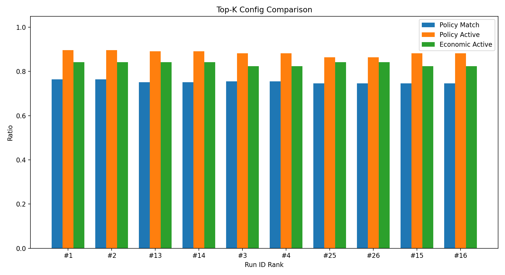
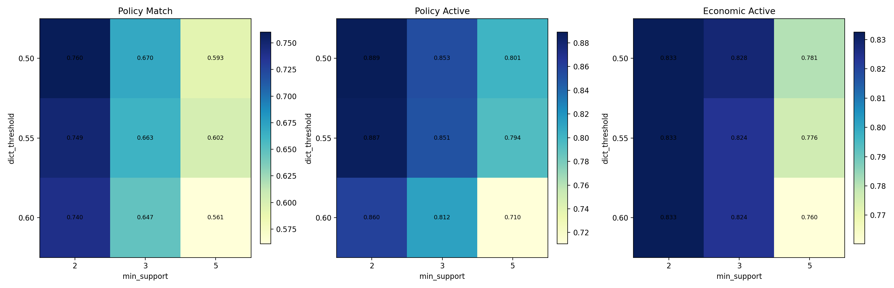
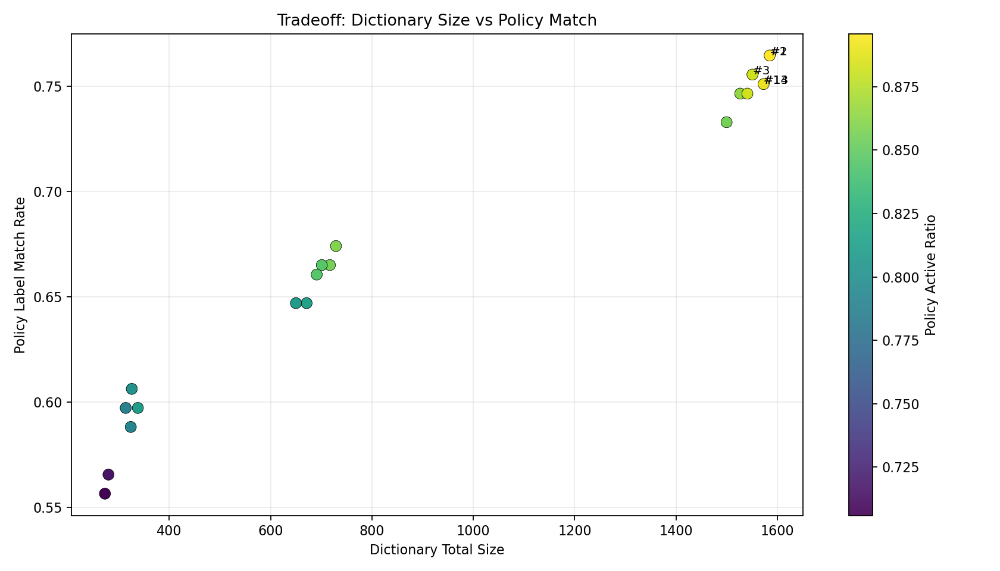
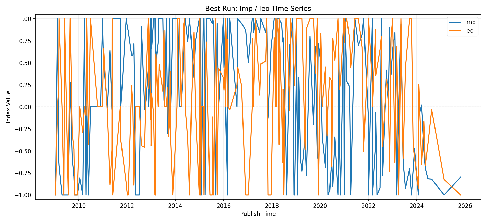

# 实验分析报告（自动版）

更新时间：2026-02-24  
数据源：`outputs/experiments/experiment_summary.xlsx`（`summary` sheet，36 组参数）

## 1. 执行摘要
本轮参数网格实验（36组）显示：

1. 最优配置为 `dict_threshold=0.50, min_support=2, min_dict_chars=3, max_event_coverage=0.30`。  
2. 近优配置（`threshold=0.55, support=2, min_dict_chars=3`）与最优组差距很小，但总体略弱。  
3. `min_support` 是影响最大的参数：从 `2 -> 3 -> 5` 时，指标稳定下降，但词典规模显著变小。  
4. `max_event_coverage` 在本轮网格下影响几乎为 0（`0.30` 与 `0.35` 指标一致）。  

最佳组关键指标：
- `dict_total_size = 1585`
- `policy_label_match_rate = 0.7647`
- `policy_event_active_ratio = 0.8959`
- `econ_event_active_ratio = 0.8416`
- `score_primary = 0.7667`

## 2. 评分与排名口径
实验主排序使用 `score_primary`（越大越好）：

`score_primary = 0.50*policy_match + 0.25*policy_active + 0.25*econ_active - 0.05*size_norm`

其中：
- `policy_match`：政策标签匹配率；
- `policy_active`：政策概率激活率；
- `econ_active`：经济概率激活率；
- `size_norm`：词典规模归一化（用于轻度惩罚过大词典）。

## 3. Top 配置对比
前 5 名如下：

| rank | run_name | threshold | support | min_dict_chars | max_event_coverage | dict_total_size | policy_match | policy_active | econ_active | score_primary |
|---|---|---:|---:|---:|---:|---:|---:|---:|---:|---:|
| 1 | `run_001_thr0.50_sup2_len3_cov0.30` | 0.50 | 2 | 3 | 0.30 | 1585 | 0.7647 | 0.8959 | 0.8416 | 0.7667 |
| 1 | `run_002_thr0.50_sup2_len3_cov0.35` | 0.50 | 2 | 3 | 0.35 | 1585 | 0.7647 | 0.8959 | 0.8416 | 0.7667 |
| 3 | `run_013_thr0.55_sup2_len3_cov0.30` | 0.55 | 2 | 3 | 0.30 | 1573 | 0.7511 | 0.8914 | 0.8416 | 0.7593 |
| 3 | `run_014_thr0.55_sup2_len3_cov0.35` | 0.55 | 2 | 3 | 0.35 | 1573 | 0.7511 | 0.8914 | 0.8416 | 0.7593 |
| 5 | `run_003_thr0.50_sup2_len4_cov0.30` | 0.50 | 2 | 4 | 0.30 | 1551 | 0.7557 | 0.8824 | 0.8235 | 0.7556 |

图 1：Top-K 组核心指标对比  

## 4. 参数敏感性分析
### 4.1 `min_support`（最关键）
- `support=2`：`score_primary` 均值 `0.7541`
- `support=3`：`score_primary` 均值 `0.7298`
- `support=5`：`score_primary` 均值 `0.6764`

结论：`support` 提高会显著降低效果，但词典变小（更保守）。

### 4.2 `dict_threshold`
- `0.50`：均值 `0.7296`
- `0.55`：均值 `0.7269`
- `0.60`：均值 `0.7038`

结论：阈值过高会损失覆盖，整体表现下滑。

### 4.3 `min_dict_chars`
- `3`：均值 `0.7251`
- `4`：均值 `0.7151`

结论：设置为 `3` 更稳妥。

### 4.4 `max_event_coverage`
- `0.30` 与 `0.35` 指标一致。

结论：在当前数据下该参数非敏感；建议默认保守取 `0.30`。

图 2：`threshold x support` 热力图（匹配率、政策激活率、经济激活率）  

## 5. 体量与效果的权衡
图 3 体现了“词典规模 vs 匹配率”的 trade-off。  
观察上看，规模从约 1600 降到 700 时，仍可保持可用效果；继续压缩到 <300 时性能下降明显。

建议：
- 追求效果优先：`0.50, 2, 3, 0.30`
- 追求体量平衡：`0.50, 3, 3, 0.30`（词典显著变小，性能有一定下降）
- 不建议：`support=5` 且 `threshold=0.60`（过度收缩）

## 6. 最佳配置下指数表现
在最佳组下，事件级指数统计：
- `Imp`：mean `0.1864`，std `0.7627`，range `[-1, 1]`
- `Ieo`：mean `0.1080`，std `0.6805`，range `[-1, 1]`

图 4：最佳配置下 `Imp/Ieo` 时间序列  

## 7. 结论与落地建议
1. 当前默认参数已合理，不建议再提高 `threshold` 或 `support`。  
2. 后续若新增样本，优先重跑 `run_experiments` 并复查热力图与 Top-K。  
3. 报告决策可直接引用本文件图表与 `experiment_summary.xlsx`。  
